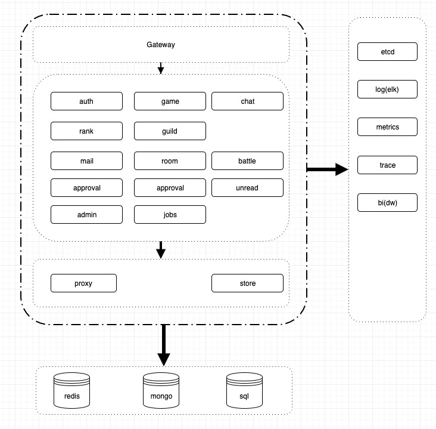

# gsk-demo

本库用于展示如果使用gsk构建一个基于微服务架构下的游戏服务器,
无论是长连接服务器,还是短连接服务器,对后端结构而言都没有本质区别,可以通过Gateway屏蔽这两者之间的差异

## 架构

- 架构解析
  - 在微服务架构下,需要根据业务拆分成不同的服务,服务之间尽可能减少依赖,服务之间需要根据调用关系分层
    - 第一层:Gateway,需要处理消息转码,消息路由,鉴权,封禁,HealthCheck,Trace等功能
    - 第二层:业务逻辑,根据不同的功能分成不同服务,这其中也可以分为两层,一层是直接给客户端提供服务,一层是给内部提供服务
      - 基础内部服务:admin,mail,jobs,unread,approval等
      - 对前端提供的服务:chat,guild,rank,game等
    - 第三层:内部系统服务,
      - store:提供存储功能,需要支持如何缓存,如何分库分表等,
        微服务架构下,可能更倾向于每个功能自己直接连接DB,游戏服务器并没有这么大的数据量,集中式可能会更简单一些
      - proxy:服务器内部路由转发
    - 代码结构:每个微服务下代码结构保持相同结构
      - main.go:入口函数
      - api: 外部调用协议定义
      - conf:配置解析
      - dao:数据库操作
      - model:数据结构
      - http:http协议相关
      - srv:服务

- API设计规范与原则
  - 幂等性:相同的请求多次执行不会产生异常,例如:多次重复发送同一条邮件,不会导致插入多次
  - 最小依赖:尽可能的减少对外部的依赖,这样容易写一些测试用例,把需要依赖的内容放到main里集中处理,例如:conf和其他模块之间,尽量不要让其他功能模块之间依赖conf中定义的结构体,而是让conf依赖其他模块的结构体,或者两者之间完全不依赖,而是在main中拷贝一次
  
- 功能设计注意事项
  - 支持配置文件多次加载
  - 支持GM开发测试,尽可能支持CRUD所有功能
  - 多记录BI和LOG信息,比如uid等信息,方便回档补偿,行为分析等后续功能

## 一些资料

- [git directory commit](https://stackoverflow.com/questions/16343659/how-to-show-git-log-history-for-a-sub-directory-of-a-git-repo)
- [git提交规范](http://www.liuocean.com/index.php/2019/11/15/zhuan-cz-gong-ju-ji-shi-yong-jie-shao-gui-fangit/)
- [api生成Swag](https://github.com/swaggo/swag)